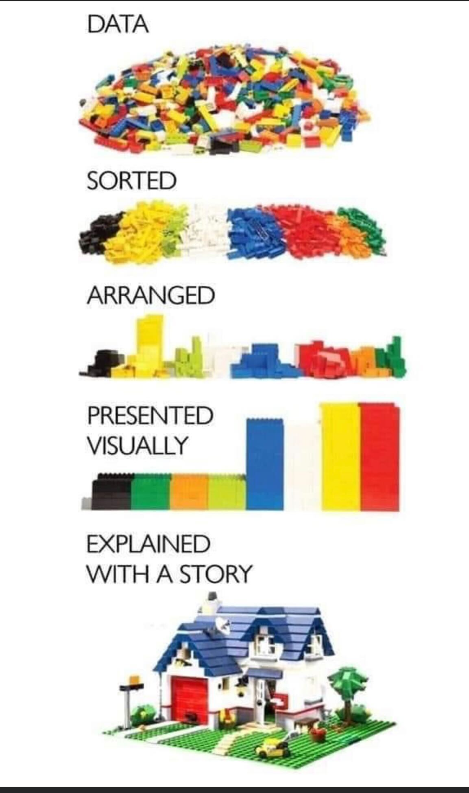

# Day 4

| **Time (PST)**    | **Activity**                        |
|-------------------|-------------------------------------|
| 9:00am - 9:50am   | *Documenting things (60 min)* |
| 9:50am - 10:00am  | *Break 1 (10 min)*                  |
| 10:00am - 11:00am | *Group Project (60min)*             |
| 11:00am - 12:00pm | *Updating your GitHub profile (Sam)*|
| 12:00pm - 1:15pm  | *Lunch (75 min)*                    |
| 1:15pm - 2:15pm   | *sharing things (60 min)*       |
| 2:15pm - 2:25pm   | *Break (10min)*                     |
| 2:25pm - 3:25pm   | *Group Project (60min)*             |
| 3:30pm - 4:30pm   | *Q&A with Casey*                    |
| 4:30pm -  ...     | *Happy hour with Ginger ;)*         |


---


# Documenting things

[**Materials**](day4-documenting.html)


---

# Sharing research products

## Why does it matter

```{r, out.width="350px", fig.retina=1, echo=FALSE}

```

[*Material*](day5-sharing_things.html)
