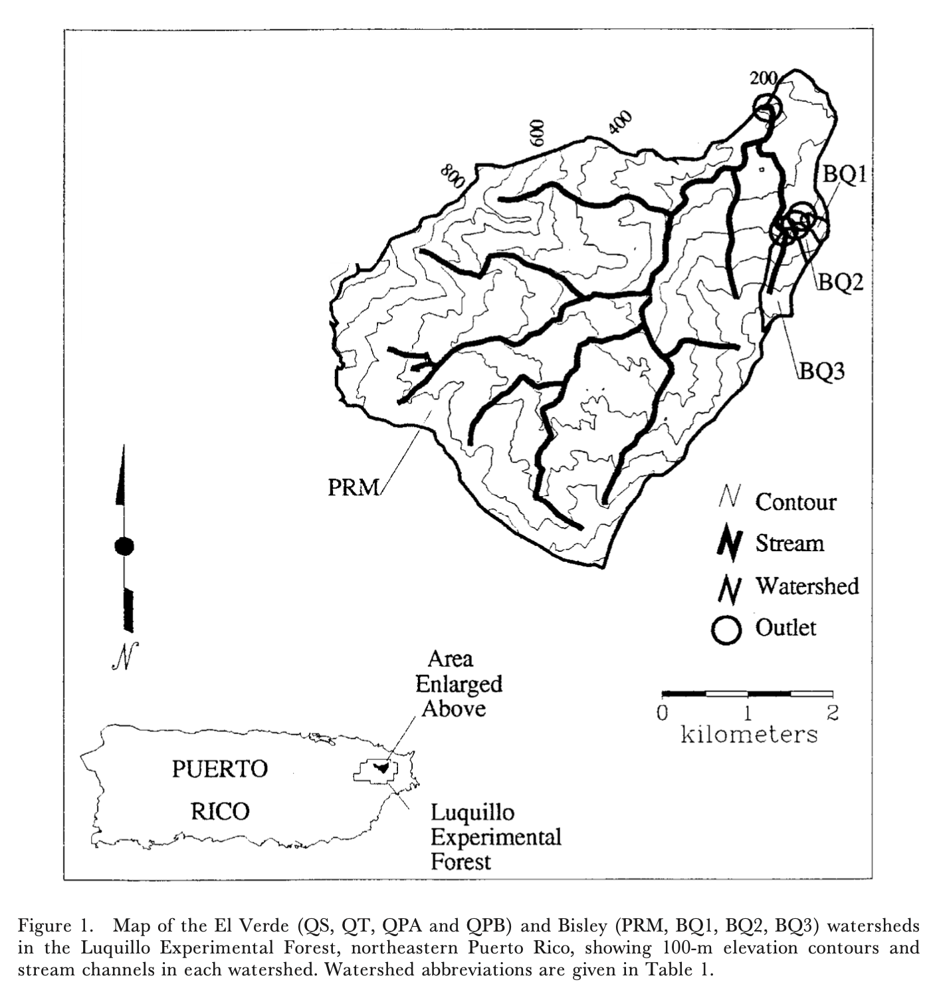

```{r setup, include=FALSE}
knitr::opts_chunk$set(echo = TRUE)
```


## Goal

**Combine 4 datasets about stream flow and water chemistry in a way that will let you investigate the impact of the 1989 Hurricane Hugo on Stream Chemistry in the Luquillo Mountains of Puerto Rico**


### A few things to know:

- Table structures are different => only some variables / columns overlap maong teh different sites
- Units used among the various sites are different
- Period covered is not perfectly aligned for all the time-series. Some sites start or end before others, but there is a period of overlap


### Study sites

```{r map}

```

### Output

We want to be able to produce this plot
```{r plot}
knitr::include_graphics("img/luq-ts-plot.png")
```

**Draw the data processing steps and You want to harmonize those data into one dataset that will let you compare time-series data (20min)**

---

### Oh wait...

[Actually here is more](hands-on_drawings_p2.Rmd)


## References

Exercise based on: Schaefer, D., McDowell, W., Scatena, F., & Asbury, C. (2000). Effects of hurricane disturbance on stream water concentrations and fluxes in eight tropical forest watersheds of the Luquillo Experimental Forest, Puerto Rico. Journal of Tropical Ecology, 16(2), 189-207. doi:10.1017/S0266467400001358

Data available here: McDowell, W. 2021. Chemistry of stream water from the Luquillo Mountains ver 4923052. Environmental Data Initiative. https://doi.org/10.6073/pasta/ddb4d61aea2fb18b77540e9b0c424684 (Accessed 2021-08-06).
